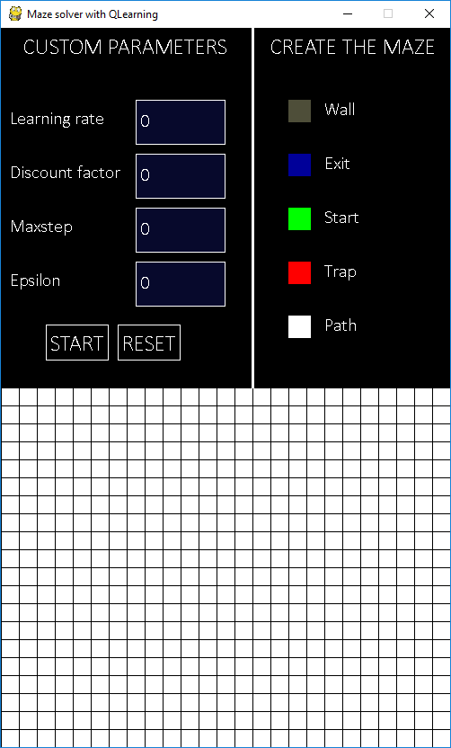
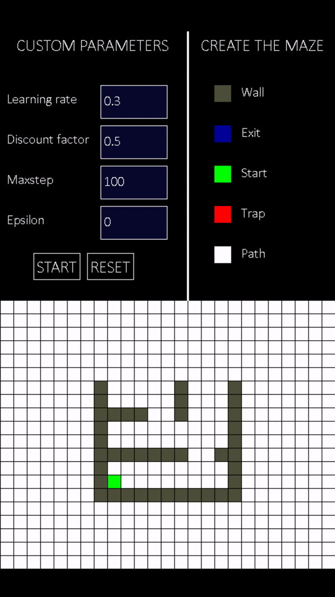

# Maze Solver with QLearning

Create a maze and find the exit path with the QLearning algorithm



## Basic use

1. Execute :
(you have to install pygame and tqdm with pip)
```
	python runme.py
```

2. 	Create a maze by clicking on the color code of the corresponding structure you want to create.
	__Warning__, in this version you can and must have only one entry and one exit. 
	If you forget to create an entry or an exit, the application will close.

3. 	Change the QLearning hyperparameters by clicking on one of the fields. 
	Only numbers are allowed, within the limit of 8 characters. 
	For the azerty keyboard, the dot key for the regular keyboard is [: /].

4. Start the solver by clicking "Start". 
__Warning__:
	* Depending on the complexity of the maze (too many boxes to explore) or bad hyperparameters, the calculation may take a long time. A patch is there to avoid crashing the application.
	* If you have filled in the fields incorrectly or if your maze is incomplete, the application will close by itself.

5. When finished, the path will be displayed.

6. You can recreate a new maze with the "RESET" button or modify the screen with the color code.

## Demo



## Without the application

You can use the solver without using the application, for that you must use the solver.py file.

You have 2 fonctions :
* __solver.Solver(args)__
* __solver.Solver.learning()__

Parameters of __solver.Solver(args)__ :
* maze : the maze which is a 2-dimensional array containing only numerical values
* learning_rate : the learning rate of the QLearning algorithm, must be between 0 and 1
* discount_factor : the discount factor of the QLearning algorithm, must be between 0 and 1
* maxstep : Number of explorations the agent will perform. 
			An exploration starts at the start and must find the exit.
* epsilon : the value of the espilon-greedy method, must be between 0 and 1
* interface : if you are using the solver with an application (True) or not (False)

Example : 
```python
	maze = [
	[0,0,0,0,0,0,0,4,2],
	[0,0,0,0,0,4,0,4,0],
	[0,0,0,0,3,4,0,0,0],
	[0,0,0,0,0,4,4,4,0],
	[1,0,0,0,0,0,0,4,3]
	]
	solver = Solver(maze,interface=False)
	#Will print the path with the direction
	print(solver.learning())
```